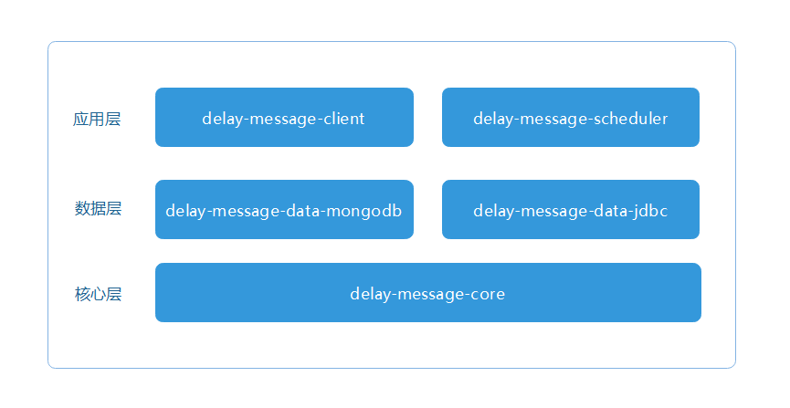

## Delay Message Program
> 基于储存设备和定时任务驱动的延时消息解决方案

<!--  -->

**模块设计**

- 应用层：客户端、调度端
- 数据层：数据储存设备
- 核心层：定义标准、公共资源




### 客户端接入

#### 1.引入delay-message-client.jar

```xml
<dependency>
    <groupId>com.github.kancyframework</groupId>
    <artifactId>delay-message-client</artifactId>
    <version>0.0.1-RELEASE</version>
</dependency>
<dependency>
    <groupId>com.github.kancyframework</groupId>
    <artifactId>delay-message-data-mongodb</artifactId>
    <version>0.0.1-RELEASE</version>
</dependency>
```

#### 2.发送延时消息

```java
@Slf4j
@RequiredArgsConstructor
@Component
public class DelayMessageClientDemo {
    private final DelayMessageClient delayMessageClient;

    /**
     * 发送消息
     */
    public void send(){
        TestDelayMessage testDelayMessage = new TestDelayMessage();
        testDelayMessage.setPayload(Collections.singletonMap("name","kancy"));
        testDelayMessage.setDelay(Duration.ofHours(5));
        delayMessageClient.send(testDelayMessage);
    }
}
```

### 调度端接入

#### 1.引入delay-message-client.jar

```xml
<dependency>
    <groupId>com.github.kancyframework</groupId>
    <artifactId>delay-message-scheduler</artifactId>
    <version>0.0.1-RELEASE</version>
</dependency>
<dependency>
    <groupId>com.github.kancyframework</groupId>
    <artifactId>delay-message-data-mongodb</artifactId>
    <version>0.0.1-RELEASE</version>
</dependency>
```

#### 2.调度

**2.1本地调度**

```java
@Slf4j
@RequiredArgsConstructor
@Component
public class DemoScheduler {
    private final DelayMessageScheduler DelayMessageScheduler;

    @Async
    @Scheduled(cron = "0/5 * * * * ? ")
    public void onConsume() {
        DelayMessageScheduler.schedule("t_delay_message", 500);
    }
}
```

**2.2分布式调度**

1）添加xxl-job配置文件

```properties
# xxl-job配置
xxl.job.admin.addresses = http://10.10.24.106:12306/xxl-job-admin/
xxl.job.executor.appname = test-schedule-dev
xxl.job.executor.port = 39501
xxl.job.executor.logpath = logs/xxljob
```

2）配置调度任务
> 调度参数：{"table":"t_delay_message", "limit": 200}

- DelayMessageTableJob（2.1.2及以下版本支持）
- DelayMessageJob（2.1.2及以上版本支持）


